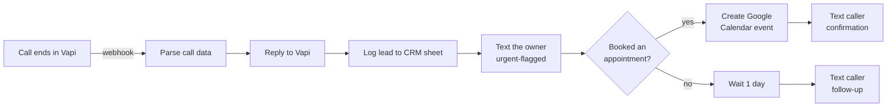
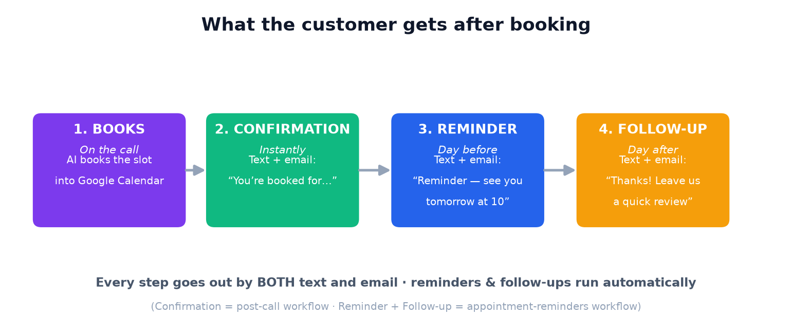

# Receptionist automation (n8n)

The behind-the-scenes pipeline that runs **after every call**. The AI receptionist captures the lead; this workflow does everything that happens next — logs it, texts the owner, books the calendar, confirms with the caller, follows up, and sends a daily summary. One workflow serves every client.

Built for **n8n** (free, open-source, self-hostable — perfect for an agency). A Make.com version is trivial to mirror; the logic is identical.

## What it does

Plus a second workflow, **Daily Summary**, that texts the owner an end-of-day recap (total calls, booked, urgent, who to call back).

## Files

| File | What it is |
|---|---|
| `n8n-receptionist-postcall.json` | The main per-call workflow (import this). |
| `n8n-appointment-reminders.json` | Reminders (day before) + post-visit follow-up/review (day after) — text **and** email. |
| `n8n-daily-summary.json` | The 6pm daily summary workflow. |

## The appointment lifecycle (what the customer gets)

1. **Books** — the AI books the slot into Google Calendar (on the call).
2. **Confirmation** — instantly, by **text + email** (handled in `n8n-receptionist-postcall.json`).
3. **Reminder** — the **day before**, by text + email ("see you tomorrow at 10").
4. **Follow-up** — the **day after**, by text + email ("thanks — leave us a quick review").

Steps 3–4 are the **`n8n-appointment-reminders.json`** workflow: it runs every morning, reads the bookings sheet, and sends a reminder for appointments happening tomorrow and a follow-up for appointments that were yesterday. It needs these columns on the sheet: `Name, Phone, Email, Business, Date (YYYY-MM-DD), When, Booked` (and optional `ReviewLink`). Connect **Twilio** (SMS) and an **SMTP/email** credential, set `FROM_EMAIL`, and toggle it Active.

## Setup (about 20 minutes, once)

### 1. Get n8n
- **Easiest:** n8n Cloud (n8n.io → free trial), or
- **Self-host (free):** `docker run -it --rm -p 5678:5678 docker.n8n.io/n8nio/n8n` → open `http://localhost:5678`.

### 2. Import the workflows
In n8n: **Workflows → Import from File →** pick `n8n-receptionist-postcall.json`. Repeat for `n8n-daily-summary.json`.

### 3. Connect your credentials (n8n → Credentials → New)
- **Twilio** (texts) — Account SID + Auth Token. Then select it on each Twilio node.
- **Google Sheets** — connect your Google account; this is your lead log / CRM backing sheet.
- **Google Calendar** — connect the account that owns the client's calendar.
- Set two environment variables on n8n: `TWILIO_FROM_NUMBER` (your Twilio number) and `DEFAULT_OWNER_PHONE` (fallback).

### 4. Make the CRM sheet
Create a Google Sheet with a tab called **`Leads`** and a header row:
`Received | Business | Name | Phone | Reason | When | Urgency | Booked | Status`
Paste the sheet's URL into the **Log to CRM sheet** node (and the same URL in the Daily Summary's **Read all leads** node).

### 5. Point the receptionist at it
Two ways to feed calls in:
- **Simplest:** in your Vapi assistant, set the `log_lead` tool's `server.url` to the n8n webhook URL (the **Call ended** node shows it — e.g. `https://your-n8n/webhook/receptionist-call`). Now every captured lead runs the whole pipeline.
- **Or** keep `server/log-lead.js` and have it forward the payload to the n8n webhook — handy if you also want the Node server's logic.

### 6. Activate
Toggle each workflow **Active** (top-right). Make a test call — you should get the owner text, a row in the sheet, and (if booked) a calendar event + caller confirmation.

## How it stays multi-client

Per-client info (`businessName`, `ownerPhone`) rides in the Vapi assistant's **metadata** — the provisioner already sets this. The Parse node reads it, so the **same workflow** texts the right owner and labels the right business for every client. No per-client copies needed.

## Customise easily

- **Follow-up timing:** change the **Wait 1 day** node (e.g. 2 hours, 3 days).
- **Email instead of SMS:** swap a Twilio node for an `Email Send` node.
- **Add a no-show check:** add a branch that re-checks the calendar before the follow-up.
- **Slack/Teams alerts for urgent:** add a Slack node off an "is urgent?" IF.

## Make.com alternative

Same shape: Webhook → Router (booked? / urgent?) → Google Sheets → Twilio → Google Calendar → Sleep → Twilio. If you prefer Make, say the word and I'll export the blueprint.
