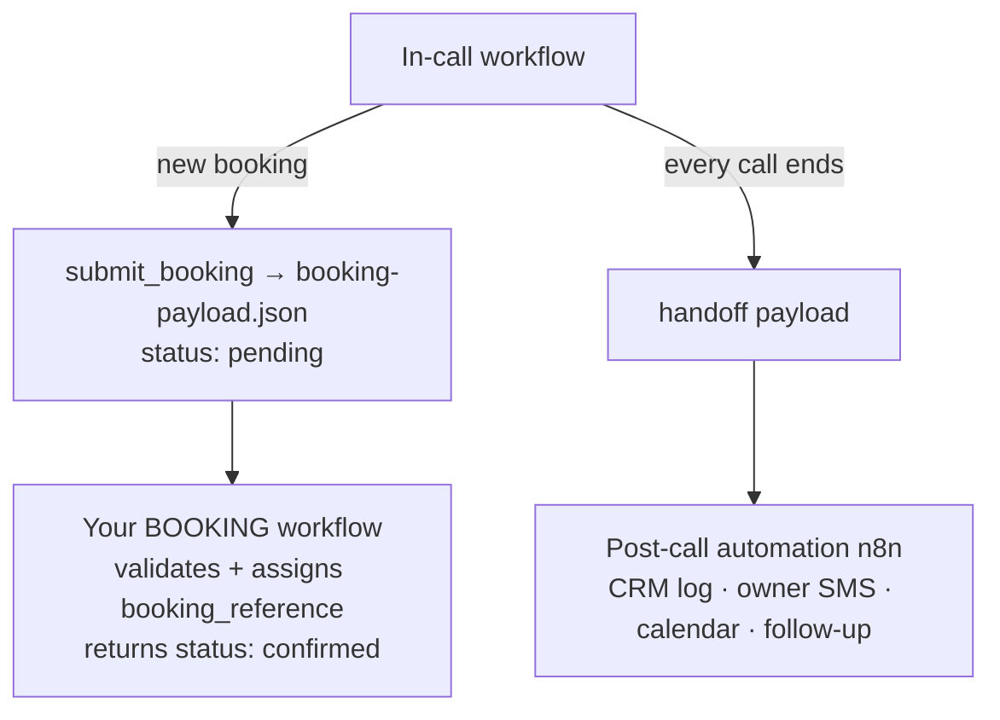

# In-Call Receptionist Workflow

The receptionist's **call brain** as a structured workflow — not one giant prompt. It follows a real reception flow and uses tools to act, then hands off clean data to the workflows around it.

```
GREET → IDENTIFY intent → UNDERSTAND (+ QUALIFY for bookings) → ACT (tools) → CONFIRM → CLOSE
```

## Files

| File | What it is |
|---|---|
| `receptionist-workflow.json` | The state machine: states, intents, tools, transitions, escalation, handoff. |
| `system-prompt.md` | The master prompt + per-task mini-prompts to paste into Vapi. |
| `booking-payload.json` | The booking object the workflow emits (your booking workflow's schema). |

## Intents it handles

new appointment · reschedule · cancel · general question · pricing · support · complaint · billing · sales/new enquiry · **emergency** (→ transfer) · message · speak-to-a-human (→ transfer).

## Tools it uses

`check_availability` · `book_appointment` · **`submit_booking`** · `manage_appointment` · `log_lead` · `transferCall`. (All wired in `vapi/assistant.template.json`; the provisioner fills the URLs.)

## How it connects to your other workflows

It produces data at **two connection points** — same gathered info, no glue code:



### 1. To the BOOKING workflow (the schema you gave me)

During a booking the receptionist **qualifies** the caller (appointment type, screening questions, location, special requests, provider) and captures contact + chosen slot, then calls `submit_booking`, which posts exactly this shape with `status: "pending"`:

```json
{
  "intent": "new_booking",
  "customer": { "name": "", "phone": "", "email": "" },
  "service": "", "appointment_type": "", "provider": "",
  "date": "", "time": "", "location": "",
  "special_requests": "", "qualification_answers": {},
  "booking_reference": "", "status": "pending"
}
```

Your booking workflow receives it at `{{BOOKING_WORKFLOW_URL}}`, books it, fills `booking_reference`, returns `status: "confirmed"` — the receptionist reads the reference back to the caller. **Point `bookingWorkflowUrl` in the provisioner at your workflow's webhook and they're connected.**

### 2. To the post-call automation

When any call ends, the workflow emits the **handoff** payload (name, phone, intent, action_taken, booked, urgency…). The n8n post-call workflow's Parse node already reads these fields → CRM log, owner SMS, calendar, follow-up, daily summary.

## To use it

1. Paste the master prompt from `system-prompt.md` into your Vapi assistant (or build it as a Vapi Workflow node graph using the per-task prompts).
2. Set `bookingWorkflowUrl` in `scripts/provision-client.js` to your booking workflow's webhook.
3. Edit `qualification_questions` in `receptionist-workflow.json` per client niche.

Send me your booking workflow's webhook/behaviour and I'll lock the two together end-to-end.
